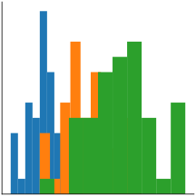
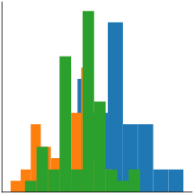
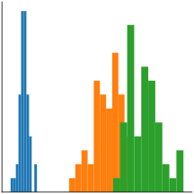
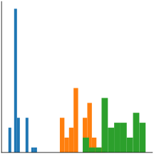

class: center, middle

# MOOC Machine learning with scikit-learn

???

Hi, welcome to the MOOC on machine learning with scikit-learn

---

# What is machine learning?

???

In this first course, we will discover what is machine learning and its
general underlying concepts.

--

Machine learning deals with building predictive models

???

In a nutshell, machine learning is about building predictive models. I
will explain what we mean by that.

---
class: center, middle

# Why and when?

Some examples of machine learning

???

Why and when would we use machine learning?

Let me start with a couple examples.

---

# Which iris is that?

???

*Pick up a iris*,

Consider flowers, for instance. I am not very good at recognizing them.
This is an iris. But what type?

--

* Setosa
* Versicolor
* Virginica

???

There are three classic types of iris,

> Setosa - Versicolor - Virginica

Maybe I can use machine learning to build mathematical rules to set them
appart?

For this, I will describe the irises with numbers. I can measure the
dimensions of there sepal and petal. *Pick up a ruler, and pretend to
measure*

--

| Sepal length | Sepal width | Petal length | Petal width | Iris type  |
| ------------ | ----------- | ------------ | ----------- | ---------- |
| 6cm          | 3.4cm       | 4.5cm        | 1.6cm       | versicolor |
| 5.7cm        | 3.8cm       | 1.7cm        | 0.3cm       | setosa     |
| 6.5cm        | 3.2cm       | 5.1cm        | 2cm         | virginica  |
| 5cm          | 3.cm        | 1.6cm        | 0.2cm       | setosa     |

???

Now I have a set of numbers describing irises. Can I build decision rules
from them? Maybe. See, for instance, it seems that setosa irises have a
very small petal.

---

# Is this person rich?

???

Let us consider a problem closer to a business case; that of estimating
the income of someone.

--

US Census data:

.small[

| age | workclass | education    | marital-status     | occupation         | relationship | race  | sex  | capital-gain | hours-per-week | native-country | class |
| --- | --------- | ------------ | ------------------ | ------------------ | ------------ | ----- | ---- | ------------ | -------------- | -------------- | ----- |
| 25  | Private   | 11th         | Never-married      | Machine-op-inspct  | Own-child    | Black | Male | 0            | 40             | United-States  | <=50K |
| 38  | Private   | HS-grad      | Married-civ-spouse | Farming-fishing    | Husband     | White  | Male | 0            | 50             | United-States   | <=50K |
| 28  | Local-gov | Assoc-acdm   | Married-civ-spouse | Protective-serv    | Husband      | White | Male | 0            | 40             | United-States   | >50K  |
| 44  | Private   | Some-college | Married-civ-spouse | Machine-op-inspct  | Husband      | Black | Male | 7688         | 40             | United-States   | >50K  |

]

???

For this, we can use data from the US census.

As you see, it gives is fairly diverse information about individuals, as
well as whether they earn more or less than 50 thousand dollars a year.
We can use machine learning to build rules that will predict this income
information from the rest of the demographic information.

You can also see that, even in a simple example like this, having
intuition about the information available on many individuals can be a
bit challenging. Data visualization will come in handy.

---
# Engineering rules: data versus experts

Expert knowledge: setosa irises have small petals

???

So, machine learning is about engineering decision rules from the data.
But experts can also engineer decision rules from their knowledge of the
problem. For instance, experts know that setosa irises have small petals.

--

<table>
<thead><tr>
	<th>Sepal length</th>
	<th>Sepal width</th>
	<th>Petal length</th>
	<th>Petal width</th>
</tr></thead>
<tbody><tr>
    <td>
    
    </td>
    <td>
    
    </td>
    <td>
    
    </td>
    <td>
    
    </td>
    </tr></tbody>
</table>

This rule can be infered from the data

???

This rule can also be infered by looking at the data. If we look at the
distribution of the sepal and petal measurements for the different iris
specis, we can see that petal length and width single well out setosa.

The benefit of machine-learning is that it automates the creation of
these rules from the data, including their details, such as where exactly
to set the threshold.

---
class: center, middle

# Predictive analysis

Beyond classic statistical tools

???

To build predictive models, we are going to rely on statistical
properties of the data. However, there questions and the tools that we
will use differ a bit from those traditionnally used in statistics.

---
# Generalization

